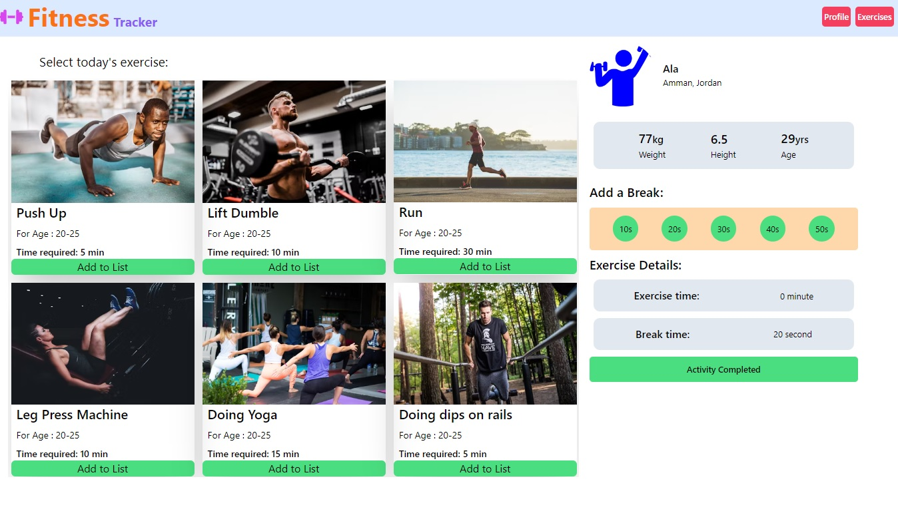

# FitnessTracker

A simple fitness tracking app to help you stay fit and healthy.

## App Result

## User Details
To personalize your fitness journey, provide the following user details:

- **Weight:** Enter your current weight to track your progress accurately.
- **Height:** Provide your height to tailor exercise recommendations based on your body type.
- **Age:** Input your age to align workouts with your fitness level and age-appropriate activities.

## Workout Details
Track your workout progress with the following information:

- **Exercise Time:** Set the duration for your exercise routine to achieve your fitness goals.
- **Break Time:** Allow yourself some rest between exercises by specifying the break duration.

## Exercise Details
Each exercise is composed of the following components:

### Activity 
- **Exercise Time:** The duration allocated for the exercise activity.

### Break 
- **Break Time:** The duration of the break between exercises.

## Result
After completing your workout, the app will display the following result:

- **Activity Completed:** Receive a notification acknowledging your hard work. Consistency is key to achieving your fitness goals. Keep it up!
